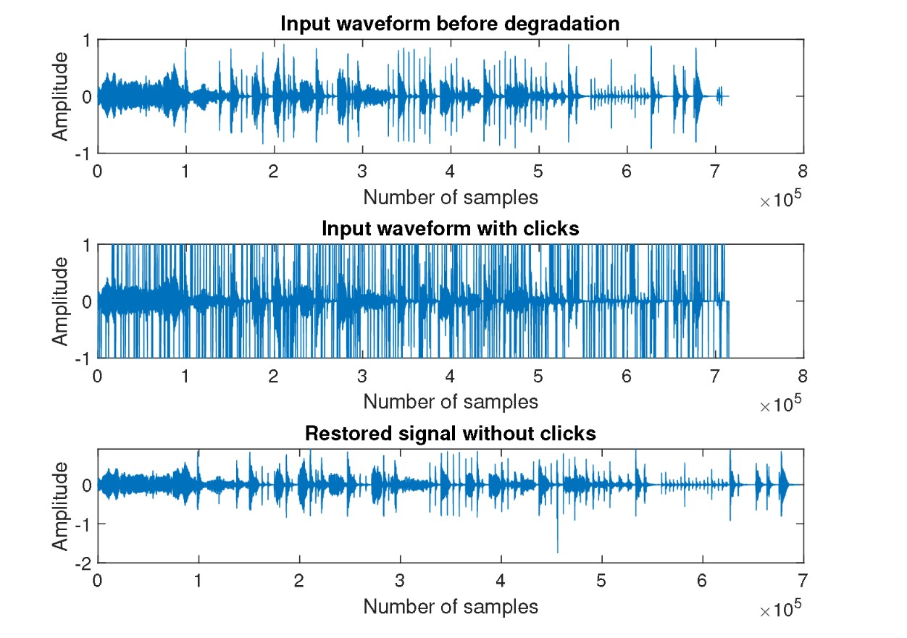

# Audio restoration using Auto-regressive filter in MATLAB

This assignment is a part of Computational Methods in Trinity College Dublin in M.Sc. Electronic Information Engineering.  

This project is about restoring audio from random added clicks by detecting the click location. To eliminate the clicks we use Auto-regressive filter and following MATLAB files are given in this project.

---

## Installation and description 

To install the following program, please download all the github files or fork the files. 

The program contains `demo.m` which is the main file and other files are `estimateARcoeffs.m`, `getResidual.m` and `interpolateAR.m`. The original signal is named as `original.wav` and it is corrupted using `Corrupt.m`

The corrupted signal, restored signal is named as `degraded.wav` and `myclean.wav` respectively. 

---
## Procedures involved in corrupting and restoring a signal:

1. `Corrupt.m` corrupts the file by adding clicks in random location and it generates the `degraded.wav`.
2. The degraded signal is given to `demo.m` file and it is main program and the child programs are `estimateARcoeffs.m`, `getResidual.m` and `interpolateAR.m`.
3. `demo.m` displays the degraded signal and passes the degraded signal in frames to ``estimateARcoeffs.m`file.
4. `estimateARcoeffs.m` program estimates the AR coefficients and builds a matrix of co-efficients for each frame.
5. `getResidual.m` finds the click location with their index and the index is saved as `error_points.mat`.
6. `interpolateAR.m` replaces the click with Auto-regressive filter algorithm's value and gives the restored signal.
7. `myclean.wav` signal is generated by `demo.m` file and audio restoration task is completed.
---

## Methodology and Results

The detailed view of methodology and results is provided in [55c22_Assignment1](https://github.com/AakashRevankar/Auto_regressive_filter/blob/415a67acc99fce663db5bcf3e670e389ccdb8d89/55C22_Assignment1.pdf) file.

The waveform of `original.wav`, `degraded.wav` and `restored.wav` is given below. The `original.wav` is almost similar to`restored.wav`, this resembles the audio restoration for the following audio is satisfied.

---
## Credits

This code was developed for purely academic purposes by AAK2511 as part of the module Computational methods. 

Resources:
- Dr Angeliki Katsenou's notes

